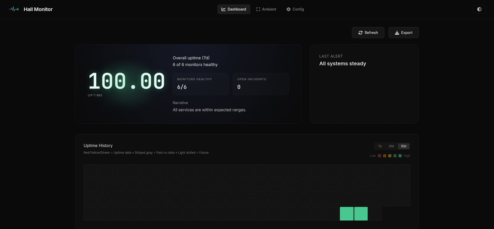

# Hall Monitor

[](https://codecov.io/gh/1broseidon/hallmonitor)

Lightweight network monitoring for home labs and Kubernetes clusters.

Hall Monitor is a Go-based monitoring solution designed for home labs and cloud-native environments. It provides HTTP, TCP, DNS, and Ping monitoring with built-in Prometheus metrics export and a lightweight web dashboard.



## Features

- **Multiple Monitor Types**
  - HTTP/HTTPS endpoints with custom headers and expected status codes
  - TCP port connectivity checks
  - DNS query monitoring with type support (A, AAAA, CNAME, MX, etc.)
  - Ping/ICMP monitoring with configurable packet counts

- **Modern Web Dashboard**
  - Real-time monitoring status with auto-refresh
  - Responsive navigation for desktop and mobile
  - Full-screen ambient mode for wall displays
  - Built-in configuration UI for monitors and groups
  - Dark/light theme toggle
  - Zero external dependencies

- **Flexible Storage**
  - **BadgerDB** - Embedded local storage (default)
  - **PostgreSQL** - SQL database backend
  - **InfluxDB** - Time-series database for metrics
  - **Metrics-only mode** - No persistence, export via Prometheus

- **Prometheus Integration**
  - Full metrics export at `/metrics`
  - Custom metrics for each monitor type
  - Process and Go runtime metrics included
  - Ready for Grafana visualization

- **Cloud Native**
  - Docker and Docker Compose support
  - Kubernetes manifests and Helm chart
  - Small footprint (~12MB binary)
  - Multi-architecture support (amd64, arm64)

## Quick Start

Get Hall Monitor running in under 2 minutes:

**1. Create a minimal config file:**

```bash
cat > config.yml << 'EOF'
server:
  port: "7878"
  host: "0.0.0.0"
  enableDashboard: true

monitoring:
  defaultInterval: "30s"
  defaultTimeout: "10s"
  groups:
    - name: "my-services"
      monitors:
        - type: "http"
          name: "example"
          url: "https://example.com"
          expectedStatus: 200
EOF
```

**2. Run with Docker:**

```bash
docker run -d \
  --name hallmonitor \
  --network host \
  --cap-add NET_RAW \
  --cap-add NET_ADMIN \
  -v $(pwd)/config.yml:/etc/hallmonitor/config.yml:ro \
  ghcr.io/1broseidon/hallmonitor:latest
```

**3. Access the dashboard:**

Open http://localhost:7878 in your browser.

**That's it!** Edit `config.yml` to add your own monitors, then restart the container.

---

### Other Installation Methods

**Docker Compose:**
```bash
docker compose up -d
```

**Kubernetes (Helm):**
```bash
helm install hallmonitor ./k8s/helm/hallmonitor -n hallmonitor --create-namespace
```

**Binary:**
Download from [Releases](https://github.com/1broseidon/hallmonitor/releases) and run:
```bash
./hallmonitor-linux-amd64 --config config.yml
```

## Configuration

Hall Monitor uses a YAML configuration file. See [config.example.yml](config.example.yml) for a complete example.

```yaml
server:
  port: "8080"
  host: "0.0.0.0"
  enableDashboard: true

monitoring:
  defaultInterval: "30s"
  defaultTimeout: "10s"

  groups:
    - name: "web-services"
      interval: "10s"
      monitors:
        - type: "http"
          name: "my-app"
          url: "https://app.example.com"
          expectedStatus: 200
```

### Environment Variables

Use environment variables in your config with `${VAR_NAME}` syntax:

```yaml
webhooks:
  - url: "${DISCORD_WEBHOOK}"
    events: ["down", "recovered"]
```

## Documentation

**Complete documentation is available in the [docs/](docs/) directory.**

Quick links:
- [Getting Started](docs/02-getting-started/index.md) - Install and configure in minutes
- [Installation Guide](docs/02-getting-started/installation.md) - All installation methods
- [Configuration Basics](docs/02-getting-started/configuration-basics.md) - Learn configuration fundamentals
- [Monitor Types](docs/03-monitors/index.md) - HTTP, TCP, DNS, Ping monitors
- [Use Cases](docs/01-introduction/use-cases.md) - Real-world examples
- [Troubleshooting](docs/05-reference/troubleshooting.md) - Common issues and solutions

See [docs/README.md](docs/README.md) for the complete documentation index.

## Installation

Hall Monitor provides pre-built Docker images and binaries for easy deployment.

### Pre-built Images

Docker images are automatically built and published to GitHub Container Registry with **multi-architecture support**:

- **Latest stable**: `ghcr.io/1broseidon/hallmonitor:latest`
- **Specific version**: `ghcr.io/1broseidon/hallmonitor:v0.1.0`

**Supported architectures** (automatically detected):
- `linux/amd64` - x86_64 systems (Intel/AMD processors)
- `linux/arm64` - ARM64 systems (Raspberry Pi 4/5, AWS Graviton, Apple Silicon)

Docker automatically pulls the correct image for your system architecture.

### Download Binaries

Pre-compiled binaries are available from the [Releases](https://github.com/1broseidon/hallmonitor/releases) page for:

**Linux:**
- `hallmonitor-linux-amd64` - Intel/AMD 64-bit
- `hallmonitor-linux-arm64` - ARM64 (Raspberry Pi, AWS Graviton)

**macOS:**
- `hallmonitor-darwin-amd64` - Intel Macs
- `hallmonitor-darwin-arm64` - Apple Silicon (M1/M2/M3)

**Windows:**
- `hallmonitor-windows-amd64.exe` - 64-bit Windows

Each binary includes a SHA256 checksum file for verification.

**Quick Start with Binary:**
```bash
# Download and extract
wget https://github.com/1broseidon/hallmonitor/releases/download/v0.1.0/hallmonitor-linux-amd64
chmod +x hallmonitor-linux-amd64

# Copy config template and customize
cp config.example.yml config.yml

# Run
./hallmonitor-linux-amd64 --config config.yml
```

### Building from Source

If you prefer to build from source:

```bash
# Prerequisites: Go 1.21 or higher

# Build for current platform
make build

# Run tests
make test

# Run with live reload during development
make dev
```

## Project Structure

```
hallmonitor/
├── cmd/server/            # Application entrypoint
├── internal/              # Core application code
│   ├── api/              # HTTP server and dashboard
│   ├── config/           # Configuration loading
│   ├── metrics/          # Prometheus metrics
│   ├── monitors/         # Monitor implementations
│   └── scheduler/        # Scheduling and workers
├── pkg/models/            # Shared data models
├── k8s/helm/             # Helm chart for Kubernetes
├── docs/                  # Documentation
└── scripts/              # Build scripts
```

## Monitoring Types

### HTTP Monitor
```yaml
- type: "http"
  name: "api-endpoint"
  url: "https://api.example.com/health"
  expectedStatus: 200
  headers:
    Authorization: "Bearer ${API_TOKEN}"
  timeout: "5s"
```

### TCP Monitor
```yaml
- type: "tcp"
  name: "database"
  target: "db.example.com:5432"
  timeout: "3s"
```

### DNS Monitor
```yaml
- type: "dns"
  name: "dns-check"
  target: "8.8.8.8:53"
  query: "example.com"
  queryType: "A"
  timeout: "3s"
```

### Ping Monitor
```yaml
- type: "ping"
  name: "gateway"
  target: "192.168.1.1"
  count: 3
  timeout: "3s"
```

## Metrics

Hall Monitor exposes Prometheus metrics at `/metrics`:

- `hallmonitor_monitor_up` - Monitor status (1=up, 0=down)
- `hallmonitor_http_response_time_seconds` - HTTP response time
- `hallmonitor_dns_response_time_seconds` - DNS query time
- `hallmonitor_ping_response_time_seconds` - Ping round-trip time
- `hallmonitor_tcp_response_time_seconds` - TCP connection time

## Development

### Hot-Reloading HTML Dashboard

During development, you can enable hot-reloading for the HTML dashboard files. When `HALLMONITOR_DEV=true` is set, the server will serve HTML files directly from disk instead of embedded assets, allowing you to see changes in real-time without rebuilding.

**Quick Start:**
```bash
# Using Make (recommended)
make dev

# Or manually
HALLMONITOR_DEV=true go run cmd/server/main.go --config config.yml
```

**How it works:**
- Set the `HALLMONITOR_DEV` environment variable to `true` or `1`
- The server will look for HTML files in `internal/api/` directory
- Changes to `dashboard.html` or `dashboard_ambient.html` will be reflected immediately on refresh
- Falls back to embedded assets if files aren't found (useful for production)

**Note:** This feature is development-only. Production builds always use embedded assets for better performance and portability.

## Contributing

Contributions are welcome! Please feel free to submit a Pull Request.

1. Fork the repository
2. Create your feature branch (`git checkout -b feature/AmazingFeature`)
3. Commit your changes (`git commit -m 'Add some AmazingFeature'`)
4. Push to the branch (`git push origin feature/AmazingFeature`)
5. Open a Pull Request

## License

This project is licensed under the MIT License - see the [LICENSE](LICENSE) file for details.

## Acknowledgments

- Built with [Fiber](https://gofiber.io/) web framework
- Configuration management by [Viper](https://github.com/spf13/viper)
- Metrics powered by [Prometheus](https://prometheus.io/)

## Support

For issues, questions, or contributions, please visit the [GitHub repository](https://github.com/1broseidon/hallmonitor).